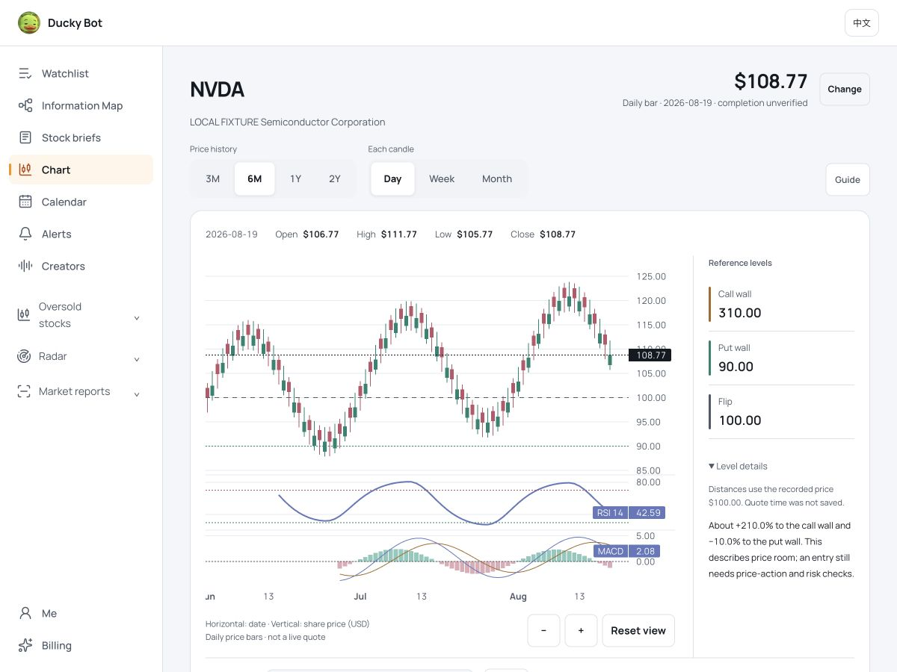
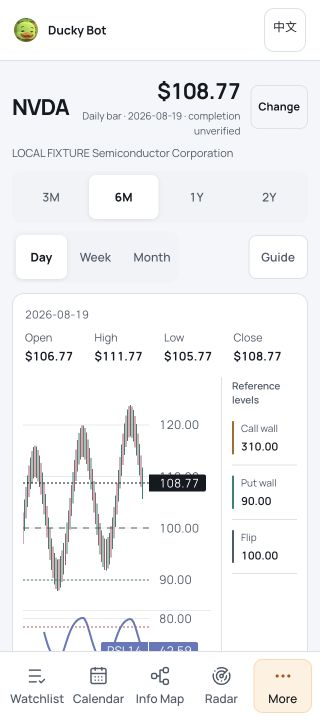

# Chart reference rail — 2026-09-08

Reference names, values and the saved-price explanation now sit beside the chart on desktop. On screens up to 900px, a 76px right column retains the prices and a full-width disclosure below the plot holds the longer explanation. The OHLC readout and option-expiry controls retain the full workspace width. A loading, missing or gated snapshot uses a full-width status instead of an empty reference column.

The horizontal reference lines remain on the plot. Their pane titles and axis tags are suppressed, so clustered option levels cannot obscure the candles or latest recorded bar price. Names, colors and numbers remain readable in the rail, including levels outside the visible price range. Range endpoints wrap as complete numbers. Expiry selection, optional ranges, fit-all, reset, theme changes and the explanatory dialog continue to use the same snapshot and calculations. The saved spot used for wall distances remains explicitly separate from the dated bar in the header.

Browser inspection caught a resize issue: inserting the rail after the snapshot arrived reduced the visible time range. The chart now preserves the selected visible time range when its width changes. No new proximity thresholds, trade signals, backend work, paid-data exports or financial algorithms were introduced.

## Verification

- Initial full frontend suite: 419 passed. Build, copy lint and 1,344 internal links passed; Python asset/export checks: 7 passed, 1 existing optional skip. Final integration and production acceptance are recorded below after release.
- 32 layouts: EN/ZH × light/dark × 320/390/600/900/901/1024/1200/1440px, height 650. Every chart painted, with no horizontal overflow or page errors. All 80 synthetic bars remained in the initial logical range (0–82 including the right margin).
- Browser interactions: 320px English light zoom in/out/reset, expiry change, optional ranges, fit-all and guide; week aggregation and resize to 1200px retained the visible range. The guide reflected the selected expiry and kept the expected-range expiry separate. No requests occurred for zoom, expiry, fit or disclosure actions.
- Final range-endpoint formatting was checked separately at 320px, with optional ranges enabled: no overflow or split numeric endpoints. Desktop host and rail occupied separate boxes (628px host, 45px separation including padding, 195px reference content at 1200px).
- Regression coverage checks overlay values and hidden chart labels, latest-price visibility, selected-expiry changes, disclosure state across redraw/theme changes and resize-listener cleanup. Existing freshness, scaling, keyboard focus and API-tier tests remain in the full gate.

[Layout measurements](chart-reference-rail-20260908/layout-matrix.json)

The fixture uses the actual application and vendored chart library, served by `reports/chart-polish-20260908/serve.py` after building. Its data is synthetic and is not investment evidence. Browser viewport and mouse/keyboard checks do not certify physical iPhone/Safari or physical pinch gestures.

Implementation references: the library's [price-line options](https://tradingview.github.io/lightweight-charts/docs/api/interfaces/PriceLineOptions) distinguish pane titles from axis tags; [time-scale options](https://tradingview.github.io/lightweight-charts/docs/api/interfaces/TimeScaleOptions#lockvisibletimerangeonresize) support retaining the visible range during resize. The existing dependency version is unchanged.
