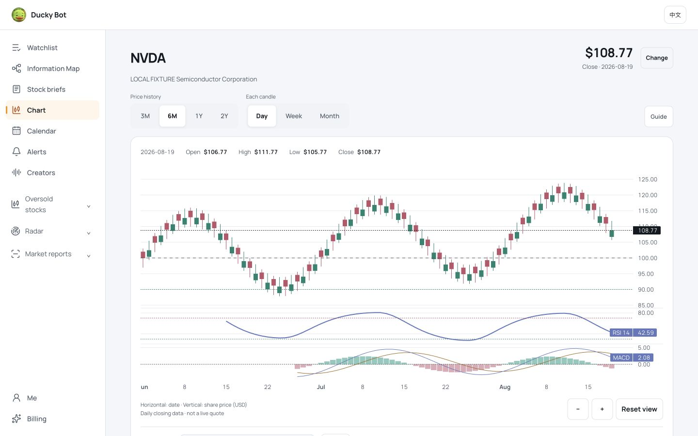
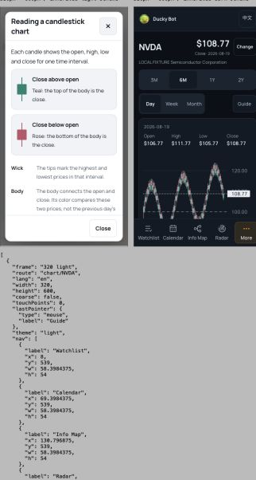

# Chart UI polish — 2026-09-08

Released to duckybot.app: frontend `e70534c06c11cf3d20db989019745e41bbb95fea`, Cloudflare Pages `661f27d3`, module graph `e49c78e8f98103545a57`. The versioned production stylesheet and main module match the local release build byte for byte. [CI check](https://github.com/ssurmic/ducky-site/actions/runs/34218623061) passed.

## Changes

- Match the Information Map typography: Manrope for ticker, price, controls, OHLC readout, educational dialogs and canvas axes. The canvas refreshes after font loading and theme changes.
- Use a chart-specific teal/rose candle palette, quieter grids and muted indicator colors in both themes. Candle direction still compares the same interval’s open and close. RSI/MACD calculations and all prices are unchanged.
- Default price scaling fits the visible candles. Distant option reference values remain listed; “Fit all reference levels” explicitly includes them in the axis. Reset clears this option and restores time/price scaling. This fixes the compressed candles and excessive empty space in the owner’s screenshot.
- Replace the daily/weekly/monthly native picker with three 44px buttons. Quiet segmented history controls retain tier limits and full accessible names. Stock search is available through “Change”; the empty chart route shows its picker without an empty canvas card.
- Split OHLC into readable fields. Omit an RSI pane when its existing calculation returns no data, while retaining the insufficient-history explanation.
- Add candle illustrations and grouped explanations. The option guide reflects the selected expiry; the singular English form is “Gamma walls · expiry”. Selecting options preserves focus. The same modal retains Escape, focus trapping and focus restoration.

## Design references

Used the existing self-hosted Lightweight Charts 5.2.1; no new chart dependency. Its official [series styling guide](https://tradingview.github.io/lightweight-charts/tutorials/customization/series) documents separate body/wick colors and border removal. The [layout options](https://tradingview.github.io/lightweight-charts/docs/api/interfaces/LayoutOptions) support explicitly setting the application font on canvas axes. The palette, controls and teaching layout here are Ducky’s own implementation.

## Verification

| Check | Result |
|---|---|
| Full frontend tests after merging current main | 397 passed |
| Build, bilingual copy checks, links | Passed; 1344 links |
| Asset tests | 4 passed; 1 existing optional skip |
| Backend clean baseline `c91339d` | 2540 passed, selftest ALL GREEN |
| 22 routes × EN/ZH × light/dark × 320/390 × 600 | 176 layouts, no overflow or page errors |
| Final chart-only narrow layout | EN 320/390 × 600, both themes: first canvas y≈362, main area 470px; inputs 16px, chart controls ≥44px |
| Desktop | 1440×900 local light; 1200×900 production dark, no overflow |
| Production | AXTI, existing Pro session, ZH 390×649 and EN 1200×900; weekly candle, zoom in/out/reset, full-reference toggle and selected-expiry guide passed; no console warnings/errors |

The broad route matrix was taken before the final chart header adjustment. The final chart check fixed an extra row on English 320px; its measurements are recorded separately. Chart-specific styles do not alter the other routes. The desktop and guide images below use synthetic, explicitly labelled local data; they are layout examples, not investment evidence.

[Route matrix](chart-polish-20260908/route-matrix.json) · [Final narrow metrics](chart-polish-20260908/mobile-en-metrics.json) · [Interaction observations](chart-polish-20260908/interaction-checks.json) · [Production asset hashes](chart-polish-20260908/production-assets.json)

## Practical boundaries

Viewport simulation and mouse/keyboard interaction were tested. This is not physical iPhone, Safari or physical pinch-gesture certification. Existing touch-scroll behavior is retained. No account/watchlist/alert/payment writes, new financial calculations, backend source acquisition or per-viewer model jobs were introduced. Control/theme changes do not fetch data; the pre-existing shared-read worker continues its independent 60-second cached-endpoint revalidation.

The local server binds to loopback on port 8912, blocks write requests and external API calls. Build first, then run `python3 reports/chart-polish-20260908/serve.py`. The fixture is adapted from the existing mobile audit harness. Production acceptance images stay local; no current paid option data is added to public static assets.
