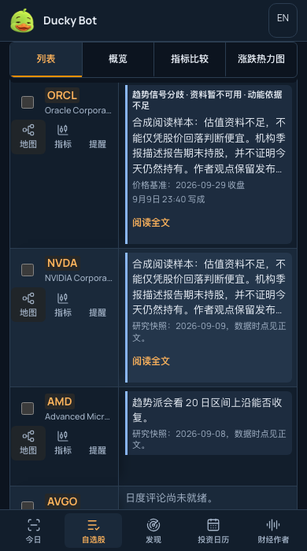
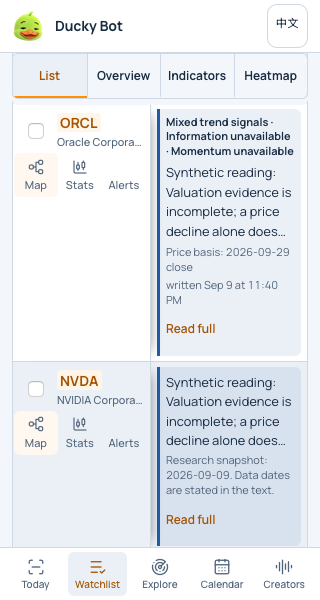
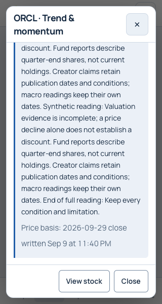

# Phone Watchlist table scrolling · 2026-09-30

Status: implemented and locally accepted; merge and production publication are separate steps. The pull request carries the final release receipt after canonical-site verification.

## Problem and change

The owner's phone screenshot shows a horizontally panned List with a nearly screen-height ORCL paragraph. Its stock identity disappears above the reading position while most of the fixed left column is empty. The wide narrative columns also make a complete paragraph difficult to see beside the fixed stock column.

On portrait phones, the List now keeps a 138px stock column and sizes each reading column to fit in the remaining viewport. Map, indicators and alert actions retain at least 44 × 44px targets. The narrow English labels use Map / Stats / Alerts; accessible names still identify the ticker and complete action. Desktop labels remain unchanged.

Long investment-case and trend paragraphs show four lines, followed by a localized Read full / 阅读全文 button. Short paragraphs need no extra button. The full-width reader keeps the ticker and perspective in a fixed heading, with the complete original paragraph, state, price-basis date and writing date. Closing it restores both table and page positions and the originating button. Short touch-screen landscape viewports use the same bounded reading pattern. Desktop keeps full inline paragraphs.

The table retains native horizontal panning; the app page owns vertical scrolling. No nested vertical table scrollport, custom drag handler, forced axis lock or pinch-zoom restriction was added. The existing four persistent view choices remain accessible.

The reader reuses delivered text without another request. Independent quote refreshes keep it open; revised or withdrawn commentary closes an obsolete reader. Existing pending states remain explicit. No API, score, research generation, source date or membership behavior changes.

## Scope and design context

- Frontend base and rollback reference: `a2358b92ff324d6231e17a8a2aa5597aaabad42a`.
- Shared backend design read at `2186120bfbc294fdea4eb940125e1a6527036145`. Its API/ownership and processing boundaries are unaffected by this presentation change.
- Applied the installed UI UX Pro Max skill's table handling, persistent navigation and mobile touch guidance to the existing design system. No new framework, font or palette.
- Synthetic long-text fixture is explicitly labelled and served only by the loopback acceptance server. It is not a production record or an account modification.

## Acceptance

`tests/browser/mobile-table-scroll.mjs` passes all 40 combinations: Chromium and WebKit; 320 × 600, 390 × 700, 430 × 700, 700 × 390 and 1440 × 900; Chinese/English; dark/light. It checks:

- Page and table overflow, a complete reading column beside the pinned stock, and hit testing of the fixed stock cell.
- Bounded phone rows, unclipped action labels and 44px action targets.
- Exact complete reader text, ticker heading, dialog bounds and scrollable body.
- Focus plus both scroll positions after closing; unchanged full desktop readings.
- Native vertical wheel input over the horizontal table in Chromium. Mobile WebKit does not expose wheel input in this runner, so it receives geometry, native touch-policy and reading/focus checks rather than a claimed gesture test.

Measured long synthetic ORCL row heights across both engines/languages/themes:

| Viewport | Row height |
| --- | --- |
| 320 × 600 | 228–258px |
| 390 × 700 | 213px |
| 430 × 700 | 213px |
| 700 × 390, touch landscape | 221–235px |

At 390 × 700 the app's content scrollport is 594px high. The initial first row begins at about 327px, leaving one complete long row plus part of the next. After scrolling into the table, two complete shorter rows are visible alongside the pinned view switcher. These are viewport measurements, not physical iPhone screenshots.

The existing `professional-ui.mjs` suite passes 20 combinations covering persistent four-view navigation, per-view scroll restoration, all 14 Indicators columns, theme contrast, action focus and company-activity categories. The Node suite passes 1,002 tests, including new reader text/date preservation, no additional read, quote refresh, source revision/withdrawal and focus/scroll regressions. The publisher's Python checks pass 14 tests; asset-isolation checks pass four with one explicit environment-dependent skip. Build, bilingual parity, copy lint and 2,196 internal links pass.

Manual in-app-browser checks confirm horizontal table panning, vertical page scrolling, full reader access and close/return on a 390 × 700 phone layout. Screenshots were inspected at 320px light English, 390px dark Chinese and short landscape. Physical iOS finger gestures were not tested.

Initial checks caught and resolved oversized inherited metadata on 320px screens, Safari's unfocused clicked-button return target, and overlapping English action labels. The runner's ambiguous cell selector and unsupported mobile-WebKit wheel call were corrected separately; they are not presented as product defects. Final browser acceptance has no failures.

## Visual evidence

All content below is synthetic UI acceptance data.

Production deployment uses `scripts/deploy_pages.sh` only after the reviewed main tip is clean. Its version and Pages receipt must be verified independently of local acceptance. Rollback is the prior frontend artifact above; no backend rollback or migration is needed.
